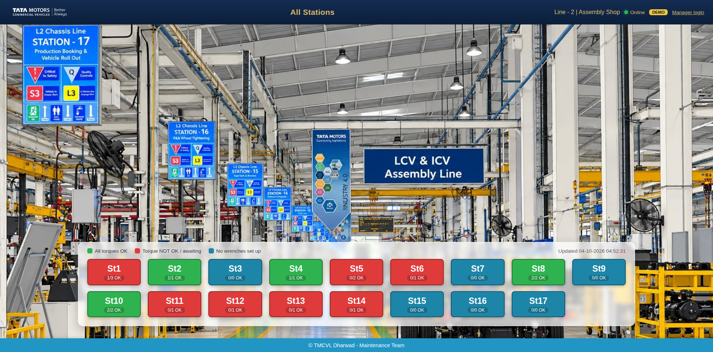
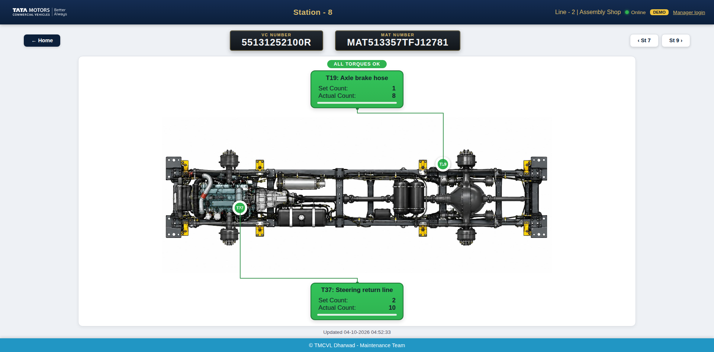

# Line 2 Torque Dashboard

A Flask dashboard for Line 2. It follows the same pattern as `andon_dashboard` in the Online-SCADA repo:
- a single `app.py` with a background poll thread
- settings in `config.ini`
- the navy/gold look, with green/red tiles and SPA-style navigation

| All stations | Station detail |
|---|---|
|  |  |

There are two interchangeable data sources, chosen with `[MAIN] source` in `config.ini`. Both feed the same pages:

| `source =` | Reads from | Use when |
|---|---|---|
| `sql` (default) | `Station_Mapping` + the log table on the Line-2 SQL Server | Working from logged data |
| `opcua` | Live tags on the SCADA's OPC UA server | Showing the SCADA's live status directly |

## Data sources (Line-2 SQL Server, port 49561)

| Table | Used for |
|---|---|
| `Station_Mapping` (`StationNumber`, `VC_Number`, `MAT_Number`) | Vehicle currently at each station, shown in the VC and MAT plates |
| `smartapp_linedata_line_log_dump` (`mat_no`, `type_data`, `data`, `in_date_time`, `shop_id_id`) | One row per tightening tool. `type_data` is the tool tag and `data` is a JSON payload |

```json
{"Name":"ST08 50Nm T37 Steering pressure line to return lin", "MAT":"MAT513357TFJ12781",
 "Station No":"STATION 8","Mode":"ACTIVE","Set Count":+2,"Actual Count":+10,"Status":"OK"}
```

`+2` is not valid JSON, so SQL Server's `JSON_VALUE` can't read it. The payload is parsed in Python.

How a station page is built:
1. The station's current MAT is joined to the log. Trailing spaces in `mat_no` are ignored by SQL Server's `=`.
2. Only rows whose `"Station No"` is this station are kept, and only the newest row per tool tag.
3. Each tool box shows its title and torque. The title comes from `Name`, e.g. "T37: Steering pressure line to return lin", and the torque (50 Nm) is shown as a chip. The box also shows Set and Actual Count and a progress bar, plus a BYPASS chip when the mode is BYPASS.
4. A tool is green when `Status` is `OK` and red otherwise. If `Status` is missing, it is red when Actual < Set.
5. A station tile is green when every tool is OK, red when any tool isn't, and grey when no data exists yet for that vehicle.

Pages refresh every 2 s. When a new vehicle arrives at a station, the plates and tool boxes switch to it automatically.

## Setup

```bash
pip install -r requirements.txt
copy config.ini.example config.ini     # fill in server / password
python app.py                          # run from inside line2_dashboard/
```

Open `http://<pc>:5001/`. The andon dashboard uses port 5000, so this one defaults to 5001.

### Port 49561

SQL Server expects the port after a **comma**, so the app connects with `SERVER=<ip>,49561`. Set `server` and
`port` in the `[SQL_LINE]` section of `config.ini`. SSMS takes the same form in its "Server name" box.

If it shows *Offline*:
- Check the port from the dashboard PC: `Test-NetConnection 172.25.208.39 -Port 49561`
- Check that the ODBC driver named in `[ODBC] driver` is installed.

### Options

| Setting | Purpose |
|---|---|
| `[MAIN] demo_mode = true` | Run on built-in sample rows without a database |
| `[MAIN] chassis_image` | Picture on the station page. Drop your own `chassis.png` into `static/` and set it here |
| `[FILTER] shop_id` | Only read log rows for this `shop_id_id` if the table is shared with other lines |
| `STATION_TOOLS` in `app.py` | Optional list of expected tool tags per station. Missing tools show as red "Awaiting data" boxes |
| `static/logo.png` | Company logo in the top bar (same file as the andon dashboard) |

If the log table grows large, this index keeps the poll fast:

```sql
CREATE INDEX IX_line_log_dump_mat_time ON dbo.smartapp_linedata_line_log_dump (mat_no, in_date_time DESC);
```

## Reading live SCADA tags (`source = opcua`)

The dashboard talks to the SCADA's **OPC UA server**. WinCC, Ignition, AVEVA/Wonderware, iFIX and Kepware all
provide one. WinCC V7.x uses `opc.tcp://<scada-ip>:4862`, other products often 4840. The PLCs on the line are never contacted directly,
so it doesn't matter that there are several of them.

**Why it doesn't slow the SCADA down:**
- **One session and one subscription** for the whole dashboard. Browsers only read the Flask server's memory, so 1 or 50 screens cost the SCADA the same.
- **Report-by-exception:** the SCADA sends a tag only when its value changes, sampled no faster than
  `publishing_interval_ms` (default 1000 ms). Nothing is polled.
- **Read-only:** nothing is ever written to the SCADA.
- **One tiny keepalive read every 15 s.** On a disconnect the dashboard shows *Offline*, keeps the last values on screen and retries every `retry_seconds`.

### Setup
1. On the SCADA, enable its OPC UA server and create a read-only user. How depends on the product; for WinCC it's in the OPC UA settings of the runtime.
2. List the tag node ids:
   ```
   python opcua_browse.py opc.tcp://<scada-ip>:4862 --start "<folder node id>" > tags.csv
   ```
3. Copy `tag_map.csv.example` to `tag_map.csv`. Add one row per tag, using `kind` = `vc`, `mat`, `set`, `actual`, `status` or `mode`:
   ```
   station,kind,tool,node_id,label,torque_nm
   1,mat,,ns=2;s=Line2.ST01.MAT_Number,,
   1,set,T1,ns=2;s=Line2.ST01.T1.SetCount,SG Tightening,
   1,actual,T1,ns=2;s=Line2.ST01.T1.ActualCount,,
   1,status,T1,ns=2;s=Line2.ST01.T1.OK,,
   ```
   - **`status`** is optional. Without it, a tool is red while Actual < Set. With it, `ok_values` in `config.ini` decides which values count as OK (default `1,true,ok`), and `bypass_values` does the same for the `mode` tag.
   - **VC/MAT:** if they aren't SCADA tags, set `mat_from_sql = true` to take them from `Station_Mapping`.
4. In `config.ini`, set `[MAIN] source = opcua` and fill in the `[OPCUA]` section. Then run `pip install asyncua` and `python app.py`.

To try it without the SCADA, run `python opcua_simulator.py`. It serves the tags in `tag_map.csv.example` with
changing counts; point `endpoint` at `opc.tcp://127.0.0.1:4840/`.

## API

- `GET /api/status`: all stations with their status, MAT and OK tool counts
- `GET /api/station/<n>`: VC, MAT, status and tool list for one station
