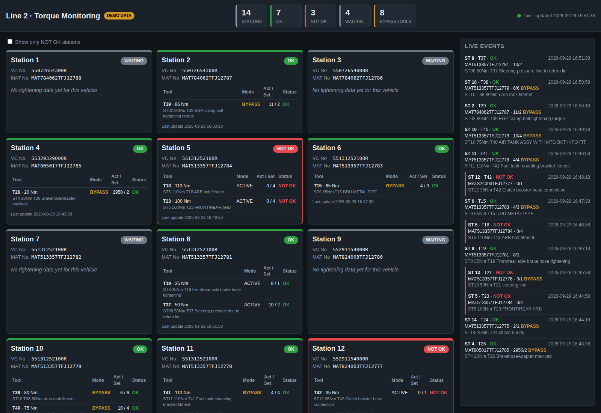

# Line 2 Torque Dashboard

A standalone live dashboard for the second line. It runs separately from the existing line's
dashboard and has its own database server, its own config and its own port.

## Data sources

| Table | Purpose |
|---|---|
| `Station_Mapping` (`StationNumber`, `VC_Number`, `MAT_Number`) | Which vehicle is at each station right now |
| `smartapp_linedata_line_log_dump` (`id`, `in_date_time`, `mat_no`, `type_data`, `data`, `shop_id_id`, …) | One row per tightening tool event. `type_data` is the tool tag (T37…), and `data` is a JSON payload |

Example `data` payload:

```json
{"Name":"ST08 50Nm T37 Steering pressure line to return lin", "MAT":"MAT513357TFJ12781",
 "Station No":"STATION 8","Operator":"","Mode":"ACTIVE","Set Count":+2,"Actual Count":+10,"Status":"OK"}
```

`+2` is not valid JSON, so SQL Server's `JSON_VALUE`/`OPENJSON` can't read it. The payload is
parsed in Python instead (`parser.py`), and the parser tolerates these values.

### How a station card is built

1. Every `Station_Mapping` row is `LEFT JOIN`ed to the log on `mat_no = MAT_Number`. Trailing
   spaces in `mat_no` are ignored by SQL Server's `=`.
2. Only rows whose `"Station No"` matches the card's station are kept (`STRICT_STATION_MATCH`).
   Earlier stations' records for the same vehicle don't leak onto the card.
3. For each tool tag, only the latest record is shown.
4. Station status: **NOT OK** if any tool is NOT OK, **OK** if all are OK, **WAITING** if no data has arrived yet.
   Tools in **BYPASS** mode are highlighted and counted in the header.

A live event feed on the right shows the latest log rows across the line.



## Connecting to the Line 2 SQL Server (port 49561)

This server only accepts connections on port **49561** at its own IP. SQL Server connection strings
separate the port with a **comma**, not a colon:

```
SERVER=172.25.208.39,49561     (SSMS "Server name" uses the same form)
```

This is set through `DB_HOST` and `DB_PORT` in `.env`. The SQL Browser service and the default port 1433 are not used.

If the connection fails:
- Check that the port is open from the dashboard PC: `Test-NetConnection 172.25.208.39 -Port 49561` (PowerShell).
- With ODBC Driver 18, keep `DB_ENCRYPT=false` or install a trusted cert. The app already sends `TrustServerCertificate=yes`.
- `GET /health` reports whether the DB is reachable and which server/port is in use.

## Run

```bash
pip install -r line2_dashboard/requirements.txt
cp line2_dashboard/.env.example line2_dashboard/.env   # then edit credentials
python -m line2_dashboard.app                          # from the repository root
```

Open `http://<pc>:5002/`. To try it without the database, set `DEMO_MODE=true`. Demo mode uses rows copied from the real tables.

## Configuration (`.env`)

| Key | Default | Notes |
|---|---|---|
| `DB_HOST` / `DB_PORT` | – / `49561` | Line 2 SQL Server |
| `DB_NAME`, `DB_USER`, `DB_PASSWORD` | `Industry4_157`, `sa`, – | |
| `DB_BACKEND` | `pyodbc` | or `pymssql` if the ODBC driver can't be installed |
| `MAPPING_TABLE`, `LOG_TABLE` | see above | `db.schema.table` |
| `SHOP_ID` | empty | filter log rows by `shop_id_id` if the table is shared between lines |
| `LOOKBACK_HOURS` | `0` | limit the log scan if the table grows large |
| `STRICT_STATION_MATCH` | `true` | show only records logged at that station |
| `REFRESH_SECONDS` | `5` | browser poll interval |
| `PORT` | `5002` | web port, kept different from the other line's dashboard |

If the log table gets large, add an index to keep the join fast:

```sql
CREATE INDEX IX_line_log_dump_mat_time ON dbo.smartapp_linedata_line_log_dump (mat_no, in_date_time DESC);
```

## API

- `GET /api/line`: all stations with their current vehicle, tool records, status and a summary
- `GET /api/events?limit=50`: latest log events
- `GET /health`: DB connectivity check
